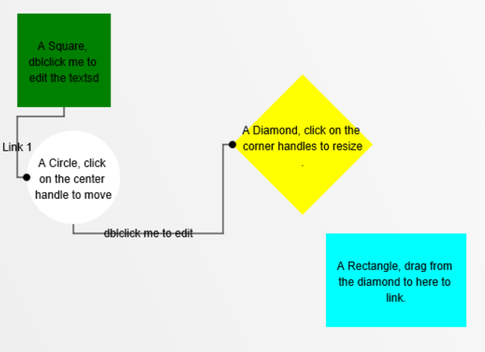
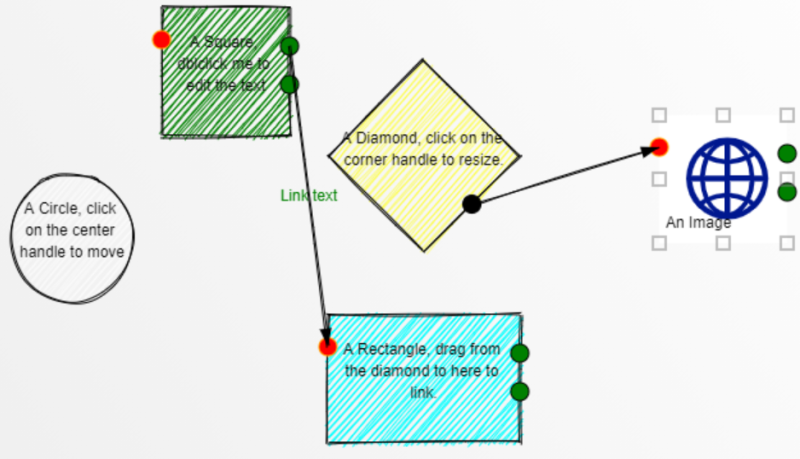

# diagramflowjs
A light javascript library to interactively create diagram flows or flowcharts.

Play with it here: https://lambot.blob.core.windows.net/github/diagramflowjs/index.html 

No jquery or external libraries dependencies.

Model can be extended by creating your own figures.



New update with the possibility of having Rough figures (https://roughjs.com/) and new sample here: https://lambot.blob.core.windows.net/github/diagramflowjs/index_rough.html 

To use Rough, you'll need to add a reference to rough.js in the html and set the rough variabe to true:
`````javascript
model.rough=false;
`````




A node is added by defining the connectors and the image render:

`````javascript
    new model.connector(x,y,mode,title,connectorDecoration,options)
`````

* x is [0,1] relative to object width
* y is [0,1] relative to object height
* mode: "input", "output", "mixed"
* title: text to show when highlighted
* connectorDecoration:
    * fillStyle:color
    * strokeStyle: color
    * highlightStrokeStyle:color
    * highlightText:color
* options:
    * dropAllowed: true/false, 
    * dragAllowed: true/false, 
    * radius: number - default:7px


Sample:

`````javascript
var connectorDecoration={
    fillStyle:"green", 
    strokeStyle: "black", 
    highlightStrokeStyle:"red", 
    highlightText:"black"};

var connectorOptions={
    dropAllowed:true, 
    dragAllowed:true, 
    radius:7};

var connectors=[
    new model.connector(0,.25,"input","input1",connectorDecoration, connectorOptions),

    new model.connector(1,.3,"output","output1",connectorDecoration, connectorOptions),
    new model.connector(1,.6,"mixed","mixed connector",connectorDecoration, connectorOptions),
];

//add the node
model.addNode(
    new model.node(x,y, width,height, connectors, text, color, renderFunction, customProperties)
    );
`````

Example of a renderFunction for a rectangle:

`````javascript
    Rectangle:function(ctx,node){ // ctx and node object
        ctx.beginPath();
        ctx.fillStyle=node.fillStyle; //node object props: fillStyle,x,y,w,h,text, data
        ctx.strokeStyle="blue";
        ctx.fillRect(node.x, node.y, node.w, node.h);
        ctx.fillStyle="black";
        ctx.font="10px Verdana";
        ctx.textBaseline="top";
        node.textfill(ctx); //render the text automatically in the bounding box
    }
`````

A link is added by calling

`````javascript
model.addLink(new model.link( fromNode, toNode, anchorFrom, anchorTo, text));
`````

Initializing the model:

`````javascript
model.init("myCanvas");
model.rough=false;
model.draw();
`````

Check the demo index.html page for a running example